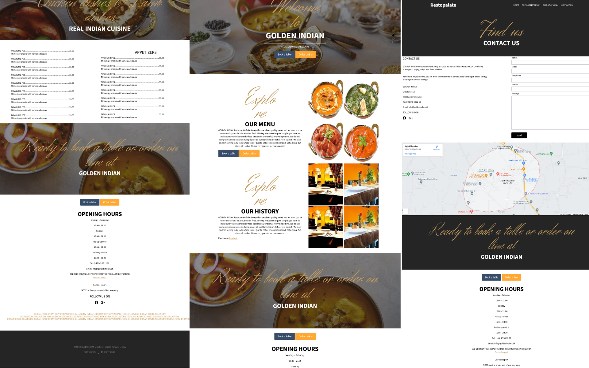

## Preview

#   Restopalate - Food Restaurant Website

Welcome to   Restopalate- Your Ultimate Destination for Delicious Food!

## Description

  Restopalate Restaurant Website project is designed for friend to delightful culinary offerings, history, and contact details of our restaurant. Whether you're a food enthusiast or looking to order a scrumptious meal, our website provides a comprehensive experience.

## Menu Categories

- **Appetizers:** Start your meal with tantalizing appetizers.
- **Main Courses:** Savor our hearty and flavorful main course dishes.
- **Desserts:** Indulge in our sweet and satisfying dessert options.
- **Beverages:** Complement your meal with refreshing beverage choices.

## Why Choose Restopalate?

- **Culinary Excellence:** Our chefs are dedicated to delivering a delightful culinary experience.
- **Online Ordering:** Conveniently place your order online with just a few clicks.
- **Quality Ingredients:** We use fresh and high-quality ingredients for all our dishes.
- **Warm Hospitality:** Experience our warm and welcoming hospitality.

## Project Features

- **Menu Display:** Browse through our diverse menu categories.
- **History Section:** Learn about the rich history and journey of Restopalate
- **Contact Details:** Find our contact information for inquiries and reservations.

## Getting Started

1. Visit our restaurant website:https://restopalate.netlify.app/
2. Explore our menu, history, and contact details.

## Contributing

If you are interested in contributing or have suggestions for improvement, feel free to reach out or submit a pull request.

## License

This project is licensed under the [MIT License](LICENSE).

---

Thank you for exploring   Restopalate Restaurant Website! We look forward to serving you with our delicious offerings and providing a delightful online experience.
